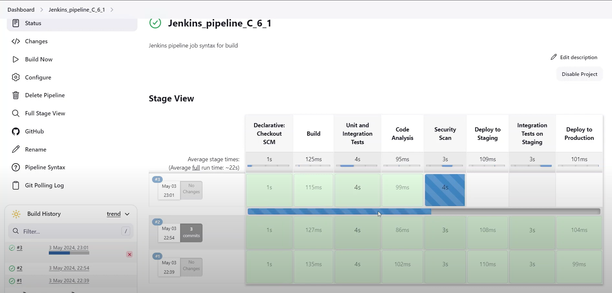
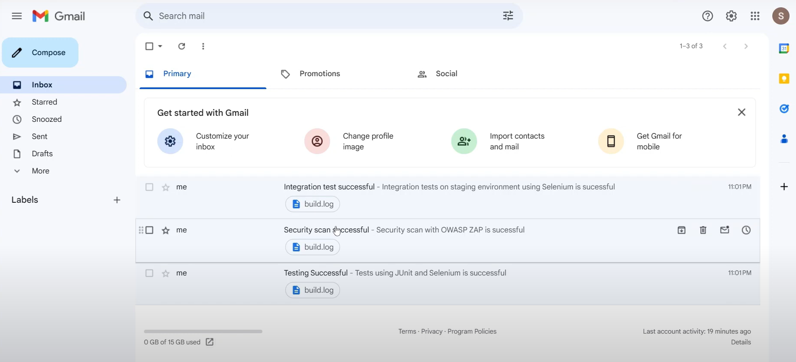

# 🚀 Jenkins Pipeline with GitHub Integration  

Welcome to the **Jenkins Pipeline with GitHub Integration** project! This repository demonstrates how to set up a fully automated CI/CD pipeline using Jenkins, integrated seamlessly with GitHub. With this project, I've applied industry best practices to streamline software development and deployment workflows.  

## 🌟 Highlights  

- **Continuous Integration & Deployment (CI/CD):** Automates building, testing, and deploying applications with ease.  
- **Integrated Email Notifications:** Keep your team informed in real-time about build statuses, test results, and deployment events.  
- **Multi-Stage Pipeline:** Includes comprehensive stages for building, testing, analyzing, and deploying code.     

## 🛠️ Project Stages  

Here's a snapshot of the stages implemented in this pipeline (Just the idea - Not the actual implementation):  

1. **🔨 Build**: Compiles and packages the application using Maven.  
2. **🧪 Unit & Integration Testing**: Runs automated tests with JUnit and Selenium.  
3. **📊 Code Quality Analysis**: Ensures high standards with SonarQube.  
4. **🔒 Security Scan**: Identifies vulnerabilities using OWASP ZAP.  
5. **📦 Staging Deployment**: Deploys the application to a staging environment on AWS EC2.  
6. **🛠️ Integration Tests on Staging**: Validates functionality in the staging environment.  
7. **🚢 Production Deployment**: Deploys the application to the production server on AWS EC2.  

## 📸 Screenshots  

Take a glimpse of the work:  

  
  

## Demo Video

Click below to see how it works

## 🌐 Repository Links  

- **GitHub Repository**: [Explore the Project](https://github.com/SSK-DeakinGit/Jenkins_pipeline_C_6_1)  

## 📈 Tools & Technologies  

This project leverages cutting-edge tools to ensure seamless automation and reliability:  

- **Jenkins**: Orchestrates the CI/CD process.  
- **GitHub**: Central repository for version control and collaboration.  

## ✨ Why This Project Matters  

This project is more than just a technical exercise—it represents my ability to:  

- 🎯 Apply Agile and DevOps principles in real-world scenarios.  
- 🛡️ Integrate security and quality checks into development workflows.  
- 📬 Communicate effectively with stakeholders using automated notifications.  
- 🌍 Deploy scalable and reliable applications in the cloud.  

## 📬 Contact  

Explore, contribute, or connect! For inquiries or feedback, reach out to me at [sathiyanarayanan.s1698@gmail.com](mailto:sathiyanarayanan.s1698@gmail.com).   

If you find this project interesting or useful, don’t forget to ⭐ star this repository. Let’s connect and build amazing things together!  

--- 
